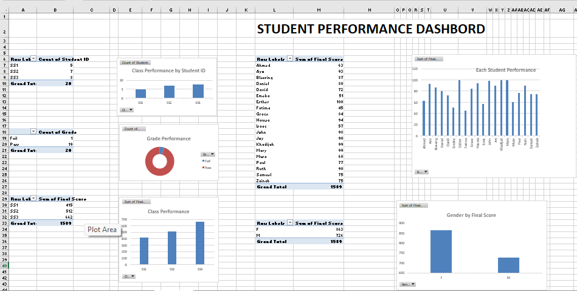

# 📊 Student Performance Dashboard (Microsoft Excel)



## 📖 Overview

The **Student Performance Dashboard** is an interactive Microsoft Excel project designed to transform raw academic data into meaningful insights through data visualization. Built using PivotTables, PivotCharts, and Excel's analytical features, the dashboard provides a centralized view of student performance, enabling educators and administrators to monitor academic outcomes efficiently.

Instead of manually analyzing spreadsheets, users can quickly identify performance trends, compare classes, evaluate individual student results, and generate reports that support data-driven decision-making.

## 🎯 Problem Statement

Educational institutions often collect large amounts of student performance data, but much of this information remains underutilized because it is stored in static spreadsheets. Analyzing such datasets manually is time-consuming, repetitive, and increases the likelihood of reporting errors.

Key questions such as:

* Which class is performing best?
* How many students passed or failed?
* Are there performance differences between male and female students?
* Which students require additional academic support?

typically require manual filtering and repetitive reporting.

The lack of an interactive reporting system makes it difficult for educators to gain timely insights and make informed decisions.
## 💡 Solution

To address this challenge, I developed an interactive Student Performance Dashboard in Microsoft Excel that converts raw student records into a visually engaging reporting system.

Using PivotTables and PivotCharts, the dashboard automatically summarizes academic data into meaningful visualizations, making it easier to identify trends, monitor performance, and communicate insights effectively.

The dashboard reduces manual effort while improving the accessibility and usability of academic data.

## ✨ Key Features

* Interactive PivotTables and PivotCharts
* Student Performance by Student ID
* Individual Student Final Score Analysis
* Class Performance Comparison (SS1, SS2 & SS3)
* Gender-Based Performance Analysis
* Grade Distribution (Pass vs. Fail)
* Automatic Summary Metrics
* Clean and User-Friendly Dashboard Layout

## 🛠 Tools & Techniques

* Microsoft Excel
* PivotTables
* PivotCharts
* Data Cleaning
* Data Analysis
* Conditional Formatting
* Dashboard Design
* Data Visualization

## 📈 Dashboard Insights

The dashboard enables users to:

* Compare academic performance across different classes.
* Analyze individual student performance.
* Monitor grade distribution.
* Evaluate performance by gender.
* Generate summary reports instantly.
* Support evidence-based academic decision-making.

## 🚀 Project Outcome

This dashboard demonstrates how Microsoft Excel can be used as a Business Intelligence tool to transform raw educational data into actionable insights.

By replacing manual reporting with interactive visualizations, the dashboard improves reporting efficiency, enhances data accessibility, and supports faster, more informed academic decisions.

## 📚 Skills Demonstrated

Through this project, I strengthened my skills in:

* Data Analysis
* Data Visualization
* Dashboard Design
* Excel Reporting
* Educational Data Analytics
* Business Intelligence
* Data Storytelling

## 🔮 Future Improvements

Potential enhancements include:

* Add interactive Slicers for dynamic filtering.
* Integrate Power Query for automated data refresh.
* Include subject-level performance analysis.
* Add attendance tracking and trend analysis.
* Recreate the dashboard in Power BI for advanced analytics and interactivity.
* 
## 📂 Repository Structure

```text
student-performance-dashboard-excel/
│
├── README.md
├── Student Performance Dashboard.xlsx
├── student-performance-dashboard.png
└── LICENSE
```
## 🤝 Let's Connect

I'm passionate about using data analytics to solve real-world problems and create meaningful insights through visualization.

If you have feedback, suggestions, or would like to collaborate on data analytics projects, feel free to connect with me.

### ⭐ If you found this project helpful or interesting, consider giving the repository a star!
